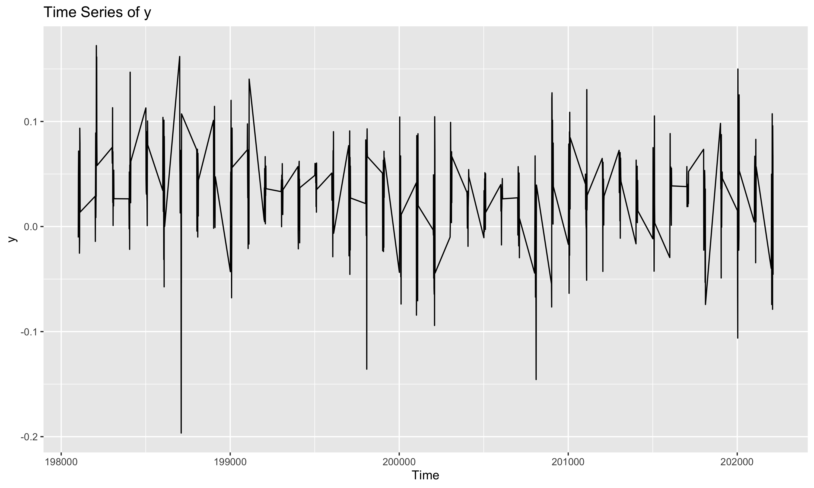
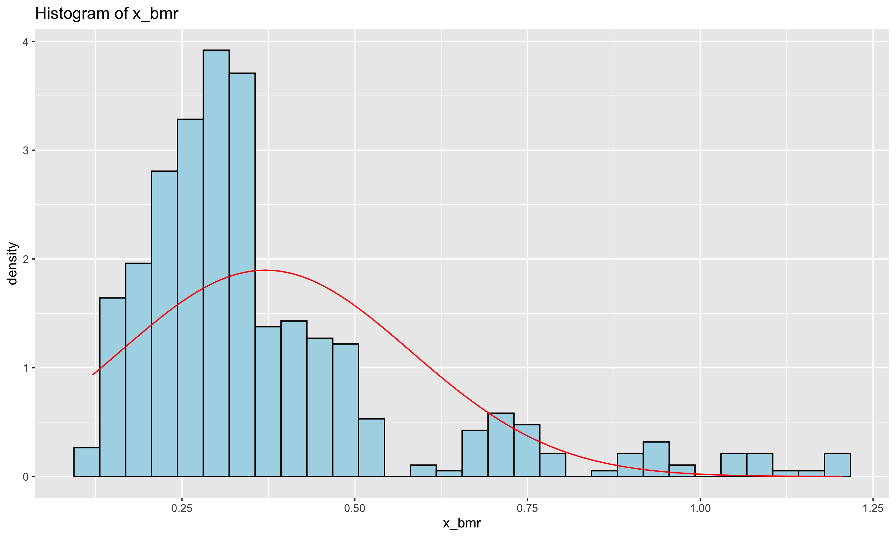

# HW1 0904: Linear Algebra

In HW1, we implement some basic linear algebra operation by R.

---

## Q1. **Data Visualization**

---

## Q2. **Matrix Trace Calculations**

Two trace calculations were performed using R:

- **Q2.1:** Trace of $X (X'X)^{-1} X'$ is calculated as follow:
  
  $\text{trace}(X (X'X)^{-1} X') = 11$

- **Q2.2:** Trace of $I - X (X'X)^{-1} X'$ is computed as follow:
  
  $\text{trace}(I_n - X (X'X)^{-1} X') = 493$

---

## Q3. **Standardized Eigenvalues Calculation**

---

## Q4. **Further Eigenvalue Analysis**

---

## Q5. **Spectral Decomposition**

Using R, we apply spectral decomposition for the matrix $\widetilde{X}$, where:

$H = \widetilde{X}' \cdot \widetilde{X}$

The matrix $A$ is calculated as:

$A = H \Lambda^{-1} H'$

This result confirms the equation provided in the problem statement.

---

## Q6. **Best Fitted b Calculation**

The best fitted $b$ is calculated as the projection of $y$ in the row space of $\widetilde{X}$. The formula used is:

$b = (\widetilde{X}'\widetilde{X})^{-1} \widetilde{X}'y$

Using R, the resulting vector $b$ is computed successfully.

---
